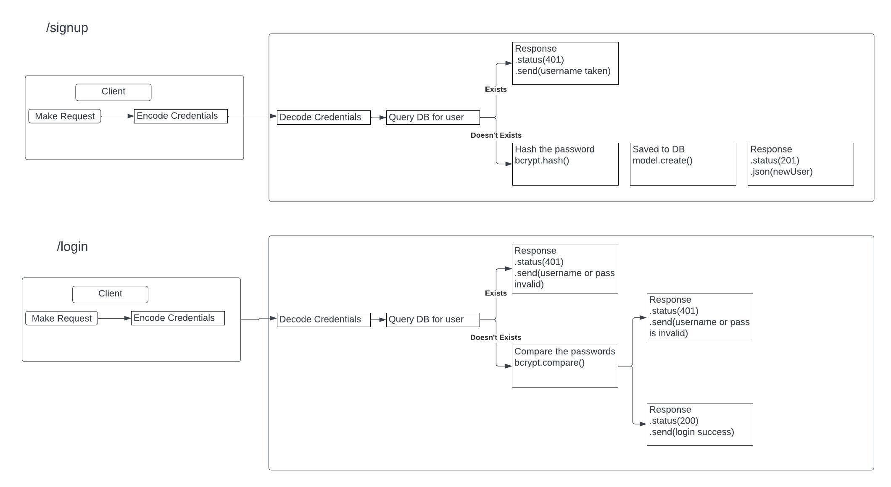

# basic-auth

Code Fellows - Code 401 - Class 06 Lab

- server deploy:

  - [BasicDeploy]()

- Github Actions:

  - [Actions](https://github.com/reedoooo/basic-auth/actions)

- Pull Requests:

  - [PRS](https://github.com/reedoooo/basic-auth/pulls)

## Server

URL: 

Endpoint: /

Example: 

## UML Architecture

## Takeaways

Always follow the instructions as carefully as possible